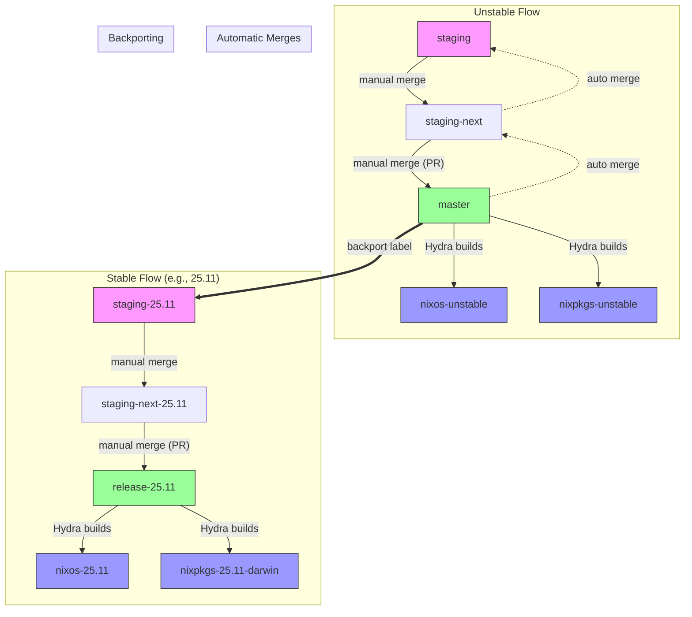

# How Bug Fixes Flow Through Nixpkgs Branches and Channels

This guide explains how changes (like bug fixes and security updates) make their way from a pull request to the various Nixpkgs release branches and channels that users consume.

## Overview

Nixpkgs uses a branching strategy to manage both cutting-edge development and stable releases. Understanding this flow helps you know when a fix will reach your system.

## The Key Branches

| Branch          | Purpose                                         | Built by Hydra? |
| --------------- | ----------------------------------------------- | --------------- |
| `master`        | Main development branch                         | Yes             |
| `staging`       | Batches mass-rebuild changes                    | No              |
| `staging-next`  | Prepares staging for merge to master            | Yes             |
| `release-YY.MM` | Stable release branches (e.g., `release-25.11`) | Yes             |
| `staging-YY.MM` | Staging branch for stable releases              | No              |

## Real-World Example: Go 1.25.6 Security Update

Let's trace [PR #480465][pr-480465], a security fix updating Go from 1.25.5 to 1.25.6.

### Step 1: Targeting the Right Branch

The PR was submitted to the `staging` branch (not `master`) because:

- The change causes **5001+ rebuilds on Linux** (labeled `10.rebuild-linux: 5001+`)
- Changes causing 1000+ rebuilds are considered "mass rebuilds" and must target `staging`

### Step 2: The Staging Workflow

Changes in `staging` follow this path:

```text
staging → staging-next → master → channels
```

1. **Staging**: Collects mass-rebuild changes
2. **Staging-next**: Tested by [Hydra][hydra] (the Nix build farm)
3. **Master**: Merged after Hydra verifies no major regressions
4. **Channels**: Eventually reaches users via `nixos-unstable` or `nixpkgs-unstable`

### Step 3: Backporting to Stable Releases

Because this was a **security fix** (labeled `1.severity: security`), it needed to reach stable releases too.

The PR had the label `backport staging-25.11`, which triggered:

1. A GitHub Action automatically created [PR #480621][pr-480621]
2. This backport PR targeted `staging-25.11` (the staging branch for the 25.11 release)
3. After merge, the fix flows: `staging-25.11` → `staging-next-25.11` → `release-25.11`

## Flow Diagram

```text
                    ┌─────────────────────────────────────────────────┐
                    │              UNSTABLE FLOW                       │
                    │                                                  │
                    │  staging ──► staging-next ──► master             │
                    │                                    │             │
                    │                                    ▼             │
                    │                            nixos-unstable        │
                    │                            nixpkgs-unstable      │
                    └─────────────────────────────────────────────────┘

                    ┌─────────────────────────────────────────────────┐
                    │              STABLE FLOW (e.g., 25.11)           │
                    │                                                  │
                    │  staging-25.11 ──► staging-next-25.11            │
                    │                           │                      │
                    │                           ▼                      │
                    │                    release-25.11                 │
                    │                           │                      │
                    │                           ▼                      │
                    │                    nixos-25.11                   │
                    │                    nixpkgs-25.11-darwin          │
                    └─────────────────────────────────────────────────┘
```

### Mermaid Diagram

> **Note:** Mermaid diagrams render on GitHub, GitLab, and other platforms with
> native Mermaid support. [Marp][marp] does not support Mermaid natively. For
> Marp presentations, use the ASCII diagram above or pre-render Mermaid diagrams
> as images using the [Mermaid CLI][mermaid-cli] or [Mermaid Live Editor][mermaid-live].



## When to Use Each Branch

| Change Type                      | Target Branch                                  |
| -------------------------------- | ---------------------------------------------- |
| Small changes (<500 rebuilds)    | `master`                                       |
| Mass rebuilds (1000+ packages)   | `staging`                                      |
| Security fixes for stable        | Backport to `release-YY.MM` or `staging-YY.MM` |
| Critical security (mass rebuild) | `staging` + backport to `staging-YY.MM`        |

## How Backports Work

### Automatic Backporting

Nixpkgs maintainers can add a `backport release-YY.MM` label to trigger automatic backporting via GitHub Actions.

### Manual Backporting

For changes that need different implementations between branches:

```bash
git checkout release-25.11
git cherry-pick -x <commit-sha>
git push
```

## From Branch to Your System

After merging, changes reach users through [Hydra][hydra] and channels:

1. Hydra builds and tests the packages
2. If successful, the channel is updated
3. Users running `nix-channel --update` or `nixos-rebuild` receive the update

Check channel status at [status.nixos.org][status-nixos].

## Key Takeaways

1. **Mass rebuilds go to staging**: If a change rebuilds 1000+ packages, it must target `staging` or `staging-YY.MM`.
2. **Security fixes get backported**: Important fixes are cherry-picked to stable release branches.
3. **Automated backporting exists**: Labels like `backport release-25.11` trigger automatic backport PRs.
4. **Channels lag behind branches**: There's a delay between merging and channel availability while Hydra builds.

## Further Reading

- [Nixpkgs Contributing Guide][contributing-staging]
- [Nix Channel Status][status-nixos]
- [NixOS Release Wiki][release-wiki]

---

[contributing-staging]: https://github.com/NixOS/nixpkgs/blob/master/CONTRIBUTING.md#staging
[hydra]: https://hydra.nixos.org
[marp]: https://marp.app/
[mermaid-cli]: https://github.com/mermaid-js/mermaid-cli
[mermaid-live]: https://mermaid.live/
[pr-480465]: https://github.com/NixOS/nixpkgs/pull/480465
[pr-480621]: https://github.com/NixOS/nixpkgs/pull/480621
[release-wiki]: https://nixos.github.io/release-wiki/
[status-nixos]: https://status.nixos.org
